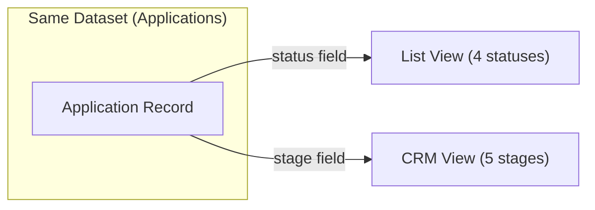

# CRM Application Card — Functional Specification

> **Version**: 1.1  
> **Date**: 2026-03-11  
> **Audience**: Product, Design, Engineering  
> **Language**: English

---

## 1. Module Overview

### What It Is

The **CRM Application Card** is the primary workspace for managing individual rental applications within the CRM pipeline. It consists of two interconnected elements:

- **Pipeline Card** — a compact summary card displayed within Kanban columns, providing at-a-glance information about the applicant, listing, and current status.
- **Detail Panel** — a slide-out side panel accessed by clicking a Pipeline Card, offering deep management capabilities through structured tabs: Overview, Notes, and Viewings.

### What Problem It Solves

- Gives property Owners a **centralized, structured view** of each application beyond simple accept/reject decisions.
- Enables **relationship management** by tracking notes, history, and property viewings within a single context.
- Provides **stage-aware tooling** (suggested note templates, rejection analysis) that guides the Owner through the deal lifecycle.
- Separates **quick triage** (List View) from **deal management** (CRM View) while operating on the same underlying dataset.

### Who Uses It

| Role | Interaction |
|------|------------|
| **Owner** | Views pipeline → Clicks card → Manages deal via Detail Panel tabs |
| **Tenant** | _No direct access_ — Tenant data is displayed but Tenants do not interact with the CRM view |

---

## 2. Core Terminology

| Term | Definition |
|------|-----------|
| **Pipeline Card** | A compact card in the CRM Kanban column representing a single application. Displays tenant name, entity type, listing, timestamp, and status indicators. |
| **Pipeline Column** | A vertical column in the Kanban board representing one CRM stage. Contains a header (dot + title + card count) and a scrollable body with Pipeline Cards. |
| **Detail Panel** | A slide-out side panel (520px wide) that appears when clicking a Pipeline Card. Contains a header, stage selector, and tabbed content area. |
| **CRM Stage** | The current position of an application within the deal pipeline (5 stages). Independent from the List View application status. |
| **Overview Tab** | Detail Panel tab showing listing info, metadata grid (type, stage, viewings count, notes count), and full history timeline. |
| **Notes Tab** | Detail Panel tab for free-text and template-based notes, with stage-aware suggested chips. |
| **Viewings Tab** | Detail Panel tab for scheduling and tracking property viewings (date, time, address, status). |
| **Suggested Note Chips** | Pre-written note templates that appear in the Notes tab, changing dynamically based on the current CRM stage. |
| **Rejection Stage Dropdown** | A special dropdown in the Notes tab (visible only in the "Rejected" stage) that records at which pipeline stage the rejection occurred. |
| **History Timeline** | A vertical timeline within the Overview tab showing all significant events (stage changes, notes added, viewings scheduled) with timestamps and color-coded dots. |
| **Viewing Status Badge** | A label on both the Pipeline Card and the Viewings tab indicating whether a viewing is "Upcoming" (Предстоит) or "Done" (Проведен). |

---

## 3. CRM Stage Model

### 3.1 Five-Stage Pipeline

| Stage | Key | Meaning | Column Color |
|-------|-----|---------|-------------|
| **New Application** (Новая заявка) | `new` | Just arrived, initial triage | `#F2994A` (orange) |
| **Initial Contact** (Первичный контакт) | `contact` | Owner has reached out to the tenant | `#2F80ED` (blue) |
| **Viewings** (Просмотры) | `viewing` | Property viewing scheduled or completed | `#9B59B6` (purple) |
| **Contract Closing** (Заключение контракта) | `contract` | Negotiation / signing of tenant agreement | `#27AE60` (green) |
| **Rejected** (Отказ) | `rejected` | Deal fell through at any stage | `#E74C3C` (red) |

> [!NOTE]
> CRM stages have **no hard transition restrictions** — any stage can be moved to any other stage via drag-and-drop or the stage dropdown in the Detail Panel. This is a deliberate design choice to give Owners maximum flexibility in pipeline management.

### 3.2 Stage Change Methods

| Method | Location | Description |
|--------|----------|-------------|
| **Drag-and-Drop** | Pipeline Kanban board | Drag a Pipeline Card from one column to another |
| **Stage Dropdown** | Detail Panel header | Select a new stage from the `<select>` dropdown |

**On every stage change:**

1. The `stage` field on the application record is updated.
2. A history entry is created with a timestamp and the transition description (e.g., `"Стадия: Новая заявка -> Первичный контакт"`).
3. The Pipeline board and Detail Panel body re-render immediately.

### 3.3 CRM Stage vs. List View Status (Independence)

> [!IMPORTANT]
> The CRM `stage` and the List View `status` are **independent fields**. Changing the stage in CRM View does **not** change the status in List View, and vice versa. They represent different dimensions of the same application:
> - **Status** (List View): triage decision — Unread → Read → Accepted / Rejected
> - **Stage** (CRM View): relationship pipeline — New → Contact → Viewings → Contract → Rejected

---

## 4. Pipeline Board Layout

### 4.1 Kanban Board Structure

The CRM Pipeline is a **horizontal Kanban board** with 5 columns, one for each CRM stage. The board has horizontal scrolling when columns exceed the viewport width.

| Component | Description |
|-----------|-------------|
| **Board Container** | `display: flex; gap: 14px; overflow-x: auto` — horizontal layout with scrolling |
| **Column** | `min-width: 220px; max-width: 280px` — fixed range, rounded corners (14px), gray background (`#f5f5f5`) |
| **Column Header** | Colored dot + stage title + card count badge |
| **Column Body** | Scrollable card list (`overflow-y: auto`), `min-height: 80px` |

### 4.2 Column Header

| Element | Description |
|---------|-------------|
| **Stage Dot** | 9×9px colored circle matching the stage color |
| **Title** | Stage label, 13px, font-weight 600 |
| **Count Badge** | Card count in a pill badge (white bg, gray border, 11px bold) |

### 4.3 Column Drag-and-Drop

| Event | Behavior |
|-------|----------|
| **Drag over column** | Column body gets a light orange highlight background (`rgba(239,90,40,0.05)`) |
| **Drag leave** | Highlight removed (only if cursor leaves the column body entirely) |
| **Drop** | Stage updated on the deal; history entry logged; entire board re-renders |

### 4.4 CRM Filtering

When the CRM tab is active, the page-level filter dropdowns change behavior:

| Filter | Label | Options |
|--------|-------|---------|
| **Stage Filter** | "Стадии" | Все · Новая заявка · Первичный контакт · **Предстоящие просмотры** · **Проведенные просмотры** · Заключение контракта · Отказ |
| **Object Filter** | "Объекты" | Все · _Dynamically populated from all deal listings_ |

> [!NOTE]
> The "Просмотры" (Viewings) stage is **split into two sub-filters** instead of a single option:
> - **Предстоящие просмотры** — shows only deals in the `viewing` stage that have at least one viewing with `status: "upcoming"`
> - **Проведенные просмотры** — shows only deals in the `viewing` stage where no viewing has `status: "upcoming"` (all done)
>
> When a filter is applied, only matching deals are shown in their respective columns. Columns with no matching deals are still visible (empty).

---

## 5. Pipeline Card (Kanban Card)

### 5.1 Card Anatomy

Each Pipeline Card displays the following data in a compact layout:

| Element | Position | Data Displayed | Styling |
|---------|----------|---------------|---------|
| **Avatar** | Top-left | Tenant's initials (2 characters) | 32×32px circle, colored background per tenant |
| **Name** | Top, next to avatar | Full tenant name + verification badge (if verified) | 12px, font-weight 600 |
| **Entity Type** | Below name | "Физ. лицо" or "Юр. лицо" (abbreviated) | 10px, gray (`var(--gray-500)`) |
| **Listing Thumbnail** | Middle row | Property photo | 34×26px, rounded corners (4px) |
| **Listing Name** | Next to thumbnail | Property name (e.g., "Кв. 4Б, Здание 1") | 11px, font-weight 500, gray (`var(--gray-700)`) |
| **Viewing Badge** | Below listing (conditional) | "Предстоит" / "Проведен" | Colored badge: blue for upcoming, green for done |
| **Timestamp** | Bottom-left | Relative time (e.g., "2 часа назад") | 10px, light gray (`var(--gray-400)`) |
| **Message Indicator** | Bottom-right (conditional) | Chat icon + count "1" | 10px, brand color (`#EF5A28`), font-weight 600 |

### 5.2 Viewing Badge Logic

The Viewing Badge is **only shown** when:

1. The deal's current stage is `viewing`, **AND**
2. The deal has at least one viewing record.

| Condition | Badge | Color |
|-----------|-------|-------|
| Any viewing has `status: "upcoming"` | **Предстоит** | Blue (`#e3f2fd` bg, `#2F80ED` text) |
| All viewings have `status: "done"` | **Проведен** | Green (`#e8f5e9` bg, `#27AE60` text) |

### 5.3 Verification Badge

A small blue checkmark SVG icon (`fill: #2F80ED`) appears next to the tenant's name if `verified: true`. This indicates the tenant has completed identity verification via OneID or E-imzo.

### 5.4 Message Indicator

A chat bubble SVG icon with a count appears in the bottom-right corner of the card when `msg: true`. Currently displays a static count of "1".

### 5.5 Card Interactions

| Interaction | Behavior |
|-------------|----------|
| **Click** | Opens the Detail Panel for this application |
| **Drag** | Initiates drag-and-drop to move card to another CRM stage column |
| **Hover** | Border changes to brand color (`#EF5A28`); subtle shadow (`var(--shadow)`); upward translate (`-1px`) |
| **Dragging (active)** | Card becomes semi-transparent (40% opacity) and slightly scaled down (97%) |
| **Drag end** | Opacity and scale restored; all `drag-over` highlights are cleared |

---

## 6. Detail Panel

### 6.1 Panel Structure

The Detail Panel is a **fixed-position side panel** (520px wide) that slides in from the right edge of the screen. It overlays the content area with a semi-transparent backdrop (`rgba(0,0,0,0.3)`).

**Animation**: slides in from `right: -520px` to `right: 0` with `300ms cubic-bezier(0.4, 0, 0.2, 1)` easing.

| Component | Description |
|-----------|-------------|
| **Close Button** | Top-right `×` button (32×32px circle, gray bg, z-index 2) |
| **Header** | Tenant avatar + name + entity type + Stage dropdown |
| **Tab Bar** | 4 tabs: Обзор (Overview), ~~Сообщения (Messages)~~, Заметки (Notes), Просмотры (Viewings) |
| **Body** | Scrollable content area (`flex: 1; overflow-y: auto; padding: 20px 28px`) that renders the active tab's content |

> [!NOTE]
> The **Сообщения (Messages)** tab is present in the tab bar but is **excluded from this specification**. It is documented separately.

### 6.2 Panel Header

| Element | Description |
|---------|-------------|
| **Avatar** | 48×48px circle with tenant initials, colored background matching the tenant's color scheme |
| **Name** | Full tenant name, 18px, font-weight 700 |
| **Entity Type** | "Физическое лицо" or "Юридическое лицо" (full form, not abbreviated), 13px, gray |
| **Stage Row** | Label "Стадия:" (12px, gray, font-weight 500) + `<select>` dropdown (rounded, 12px, font-weight 600) with all 5 stages; current stage is pre-selected |

### 6.3 Tab Bar

| Tab | Label | Position |
|-----|-------|----------|
| Overview | Обзор | 1st (leftmost) |
| Messages | Сообщения | 2nd (excluded from this spec) |
| Notes | Заметки | 3rd |
| Viewings | Просмотры | 4th (rightmost) |

**Tab styling**: 13px, font-weight 500, gray text. Active tab: brand color (`#EF5A28`), font-weight 600, orange bottom border (2px).

### 6.4 Stage Dropdown Behavior

- Populated with all 5 CRM stages on panel open.
- The current stage is `selected` by default.
- **On change**: triggers `changeStageFromPanel()` which:
  1. Records the old stage label
  2. Updates the `stage` field on the deal
  3. Creates a history entry with format: `"Стадия: {old label} -> {new label}"` colored with the destination stage color
  4. Re-renders the Pipeline board (card moves to new column)
  5. Re-renders the Detail Panel body
- No restrictions — any stage can be selected from any other stage.

### 6.5 Default Tab on Open

When the Detail Panel opens, the active tab always resets to **Обзор (Overview)**, regardless of which tab was active during a previous panel session.

---

## 7. Overview Tab

The Overview tab provides a read-only summary of the application, divided into three sections:

### 7.1 Listing Section (ОБЪЕКТ)

| Element | Data |
|---------|------|
| **Section Title** | "ОБЪЕКТ" (11px, uppercase, gray, letter-spacing 0.5px) |
| **Thumbnail** | 64×48px property image, rounded corners (8px) |
| **Listing Name** | Property name (14px, font-weight 600) |
| **Submission Time** | "Заявка: {relative time}" (12px, gray) — e.g., "Заявка: 2 часа назад" |

### 7.2 Metadata Grid (ИНФОРМАЦИЯ)

| Element | Data |
|---------|------|
| **Section Title** | "ИНФОРМАЦИЯ" (11px, uppercase, gray, letter-spacing 0.5px) |

A **2×2 grid** (`grid-template-columns: 1fr 1fr; gap: 12px`) of key metrics, each in a card with gray background (`var(--gray-100)`), border-radius 10px:

| Cell | Label (11px, gray) | Value (14px, bold) |
|------|-----|-------|
| Top-left | Тип | Entity type (Физическое лицо / Юридическое лицо) |
| Top-right | Стадия | Current CRM stage label (e.g., "Новая заявка") |
| Bottom-left | Просмотры | Count of viewing records (e.g., "0") |
| Bottom-right | Заметки | Count of note records (e.g., "1") |

### 7.3 History Timeline (ИСТОРИЯ)

| Element | Data |
|---------|------|
| **Section Title** | "ИСТОРИЯ" (11px, uppercase, gray, letter-spacing 0.5px) |

A vertical timeline showing all significant events in **reverse chronological order** (newest first):

| Element | Description |
|---------|-------------|
| **Timeline Line** | 2px vertical line, gray (`var(--gray-200)`), positioned left of entries |
| **Dot** | 12×12px colored circle, color corresponds to the related stage; 2px white border |
| **Timestamp** | 10px, light gray (`var(--gray-400)`), above the event text |
| **Event Text** | 13px, gray (`var(--gray-700)`), line-height 1.4, with bold highlights for stage names |

**Events logged in history:**

- Stage creation: `"Новая заявка создана"` (orange dot `#F2994A`)
- Stage transitions: `"Стадия: {old} -> {new}"` (colored by destination stage)
- Note additions: `"Добавлена заметка"` (blue dot `#2F80ED`)
- Viewing scheduling: `"Просмотр назначен на {DD.MM} в {HH:MM}"` (blue dot `#2F80ED`)

---

## 8. Notes Tab

### 8.1 Layout Structure

The Notes tab is organized top-to-bottom in the following order:

1. **Existing Notes** (reverse chronological, newest first)
2. **Rejection Stage Dropdown** (conditional — only when `stage === 'rejected'`)
3. **Note Input** (textarea with placeholder)
4. **Suggested Note Chips** (stage-aware templates — conditional)
5. **Add Button** (full-width, dark background)

### 8.2 Note Card

Each note is displayed as a card with gray background (`var(--gray-100)`), border-radius 10px, padding 14px:

| Element | Description |
|---------|-------------|
| **Header Row** | Timestamp (left) + Action buttons (right), flex layout with `justify-content: space-between` |
| **Timestamp** | 10px, light gray (e.g., "Сегодня, 14:30") |
| **Edit Button** | Pencil SVG icon (13×13px); hover: gray background. Moves note text to the input field for editing, removes original |
| **Delete Button** | Trash SVG icon (13×13px); hover: red background (`#feecec`), red icon color. Removes the note immediately |
| **Note Text** | 13px, gray (`var(--gray-700)`), line-height 1.5 |

### 8.3 Note Actions

| Action | Description |
|--------|-------------|
| **Add Note** | Type text in textarea → Click "Добавить" → Note saved with current timestamp; history entry "Добавлена заметка" (blue dot) created |
| **Edit Note** | Click pencil icon → Note is removed from list → Text populates the textarea (with 50ms delay for DOM) → User edits and re-adds |
| **Delete Note** | Click trash icon → Note is removed immediately; no confirmation dialog |

> [!NOTE]
> Editing is implemented as a **delete + pre-populate** pattern: the original note is removed, its text is placed in the input field, and the user saves it as a new note. This means the original timestamp is lost.

### 8.4 Note Input Area

| Element | Description |
|---------|-------------|
| **Textarea** | Full-width, border `1px solid var(--gray-200)`, border-radius 10px, 13px font, min-height 70px, resizable vertically |
| **Placeholder (default)** | "Добавить заметку..." |
| **Placeholder (rejected stage)** | "Причина отказа..." |
| **Add Button** | Full-width, dark background (`var(--dark)`), white text, "Добавить", border-radius 8px, 13px font-weight 600 |

### 8.5 Suggested Note Chips

Suggested Note Chips are **stage-aware pre-written templates** that appear between the textarea and the Add button. Clicking a chip instantly saves it as a new note with a current timestamp and creates a history entry.

**Section label**: "Рекомендации" (10px, uppercase, gray, letter-spacing 0.4px)

**Chip styling**: Inline pill buttons (11px, `#5a6f85` text, `#f0f4f8` bg, `#dce3eb` border, rounded 14px). Hover: brand color text and border, brand-light bg. Click: slight scale-down (97%).

| CRM Stage | Suggested Templates |
|-----------|-------------------|
| **New Application** (`new`) | _No chips shown_ |
| **Initial Contact** (`contact`) | "Клиент заинтересован, просит подробности" · "Клиент просит перезвонить позже" · "Клиент хочет назначить просмотр" · "Клиент сравнивает с другими вариантами" · "Клиенту не понравилось" |
| **Viewings** (`viewing`) | "Просмотр только предстоит" · "Просмотр прошел успешно — клиенту всё понравилось" · "Просмотр прошел неуспешно — клиенту не понравилось" · "Клиент просит повторный просмотр" · "Клиенту не понравилось" |
| **Contract Closing** (`contract`) | "Договор отправлен клиенту на рассмотрение" · "Клиент подписал договор" · "Клиент просит изменить условия договора" · "Ожидается оплата залога" · "Клиенту не понравилось" |
| **Rejected** (`rejected`) | "Клиенту не понравились условия" · "Клиенту не понравилась цена" · "Клиент выбрал другой вариант" · "Клиент передумал арендовать" · "Клиенту не понравилось" |

### 8.6 Rejection Stage Dropdown

When the deal is in the **Rejected** (`rejected`) stage, a special dropdown appears between the existing notes list and the textarea:

| Property | Details |
|----------|---------|
| **Label** | "Этап отказа" (11px, uppercase, font-weight 600, gray, letter-spacing 0.4px) |
| **Dropdown Styling** | Full-width, padding 8px 12px, border-radius 8px, 13px font, custom chevron, white background |
| **Options** | Первичный контакт · Просмотры · Заключение контракта |
| **Default** | Placeholder "Выберите этап" (disabled, hidden) |
| **Purpose** | Records at which pipeline stage the rejection occurred, enabling analytics on bottlenecks |
| **Visibility** | Only visible when `stage === 'rejected'` |

---

## 9. Viewings Tab

### 9.1 Schedule Viewing Form

A compact form at the top of the Viewings tab with gray background (`var(--gray-100)`), border-radius 10px, padding 14px:

| Element | Description |
|---------|-------------|
| **Form Title** | "Назначить просмотр" (13px, font-weight 600) |
| **Date + Time Row** | Two inputs side-by-side (`display: flex; gap: 10px`) |
| **Date Input** | `<input type="date">` — 8px padding, border-radius 8px, white bg |
| **Time Input** | `<input type="time">` — 8px padding, border-radius 8px, white bg |
| **Address Input** | `<input type="text">` — full-width, placeholder "Адрес", pre-populated with the listing name; editable |
| **Submit Button** | "Назначить" — aligned right, dark background (`var(--dark)`), white text, border-radius 8px, 13px font-weight 600 |

**Validation:** All three fields (date, time, address) must be non-empty. If any field is empty, the form does nothing on submit.

**On submit:**

1. A viewing record is created with `status: "upcoming"`.
2. A history entry is logged: `"Просмотр назначен на {DD.MM} в {HH:MM}"` (blue dot `#2F80ED`).
3. Both the Detail Panel body and the Pipeline board re-render (to update viewing badges on cards).

### 9.2 Viewing Card

Each viewing is displayed as a horizontal card with gray background (`var(--gray-100)`), border-radius 10px, padding 14px:

| Element | Description |
|---------|-------------|
| **Date Box** | 48×48px white box with border (`1px solid var(--gray-200)`), border-radius 10px. Day number (16px, font-weight 700, dark) and abbreviated month (9px, uppercase, font-weight 600, gray) |
| **Time** | Viewing time, 13px, font-weight 600, dark |
| **Address** | Full address, 12px, gray (`var(--gray-500)`), margin-top 2px |
| **Status Badge** | Rounded pill (11px, font-weight 600, border-radius 12px): "Предстоит" (blue) or "Проведен" (green) |

**Month abbreviations used:** Янв, Фев, Мар, Апр, Май, Июн, Июл, Авг, Сен, Окт, Ноя, Дек

### 9.3 Viewing Statuses

| Status | Key | Badge Color | Meaning |
|--------|-----|------------|---------|
| **Upcoming** (Предстоит) | `upcoming` | Blue (`#e3f2fd` bg, `#2F80ED` text) | Viewing is scheduled but has not yet occurred |
| **Done** (Проведен) | `done` | Green (`#e8f5e9` bg, `#27AE60` text) | Viewing has been completed |

### 9.4 Empty State

When there are no viewings: centered message **"Нет просмотров"** (13px, gray, 20px padding).

---

## 10. Application Data Model

Each application in the CRM pipeline contains the following data fields:

| Field | Type | Description |
|-------|------|-------------|
| `id` | number | Unique application identifier |
| `initials` | string | 2-character initials for avatar display |
| `bg` | string | Background color for avatar circle (hex) |
| `color` | string | Text color for avatar circle (hex) |
| `name` | string | Full tenant name |
| `verified` | boolean | Whether the tenant has completed identity verification |
| `entity` | string | "Физическое лицо" or "Юридическое лицо" |
| `listing` | string | Property name/identifier |
| `thumb` | string | URL to property thumbnail image |
| `time` | string | Relative time label (e.g., "2 часа назад") |
| `msg` | boolean | Whether the deal has messages (shows message indicator) |
| `status` | string | List View status: `unread`, `read`, `accepted`, `rejected` |
| `stage` | string | CRM stage: `new`, `contact`, `viewing`, `contract`, `rejected` |
| `notes` | array | Array of `{ text: string, time: string }` objects |
| `viewings` | array | Array of `{ date: string, time: string, addr: string, status: string }` objects |
| `history` | array | Array of `{ time: string, text: string, color: string }` objects |
| `messages` | array | Array of `{ from: string, name: string, text: string, time: string, date: string }` objects |

---

## 11. Key Actions

### 11.1 Open Detail Panel

| Property | Details |
|----------|---------|
| **Who** | Owner |
| **Where** | Click any Pipeline Card in the CRM Kanban board |
| **Process** | 1. Active tab resets to "Обзор" (Overview) 2. Avatar populated with tenant initials, bg color, and text color 3. Name and entity type displayed 4. Stage dropdown populated with all 5 stages, current stage pre-selected 5. Overlay backdrop fades in (`opacity: 0 → 1`) 6. Panel slides in from right (`right: -520px → 0`, 300ms cubic-bezier) |
| **Close** | Click `×` button, or click the overlay backdrop |

### 11.2 Change CRM Stage (Dropdown)

| Property | Details |
|----------|---------|
| **Who** | Owner |
| **Where** | Stage dropdown in Detail Panel header |
| **Process** | 1. Owner selects a new stage 2. Old stage label recorded 3. `stage` field updated on the deal 4. History entry created: `"Стадия: {old} -> {new}"` with destination stage color 5. Pipeline board re-renders (card moves to new column) 6. Detail Panel body re-renders with updated data |
| **Restrictions** | None — any stage-to-stage transition is allowed |

### 11.3 Change CRM Stage (Drag-and-Drop)

| Property | Details |
|----------|---------|
| **Who** | Owner |
| **Where** | CRM Kanban board — drag card between columns |
| **Process** | 1. Owner drags a Pipeline Card (card becomes 40% opacity, 97% scale) 2. Target column body highlights with orange tint (`rgba(239,90,40,0.05)`) 3. On drop: old stage label recorded, stage updated, history entry created, board re-renders 4. If the Detail Panel is open for the dragged card, its body also re-renders 5. All drag-over highlights are cleared |
| **Restrictions** | None — any stage-to-stage move is allowed |

### 11.4 Add Note

| Property | Details |
|----------|---------|
| **Who** | Owner |
| **Where** | Notes tab → textarea + "Добавить" button, or via Suggested Note Chip |
| **Process (manual)** | 1. Owner types note text in textarea 2. Clicks "Добавить" 3. Note saved with current timestamp (format: "Сегодня, HH:MM") 4. History entry: "Добавлена заметка" (blue dot `#2F80ED`) 5. Notes tab re-renders showing new note at top |
| **Process (chip)** | 1. Owner clicks a Suggested Note Chip 2. Chip text saved as note immediately with current timestamp 3. Same history entry created 4. Notes tab re-renders |
| **Validation** | Empty text is silently ignored (manual only) |

### 11.5 Edit Note

| Property | Details |
|----------|---------|
| **Who** | Owner |
| **Where** | Notes tab → pencil icon on existing note card |
| **Process** | 1. Original note is removed from the notes array 2. Notes tab re-renders 3. After 50ms delay, textarea is populated with the removed note's text 4. Textarea receives focus 5. Owner edits text and clicks "Добавить" to save as a new note |

### 11.6 Delete Note

| Property | Details |
|----------|---------|
| **Who** | Owner |
| **Where** | Notes tab → trash icon on existing note card |
| **Process** | Note is removed immediately from the notes array; tab re-renders |
| **Confirmation** | None — deletion is immediate |

### 11.7 Schedule Viewing

| Property | Details |
|----------|---------|
| **Who** | Owner |
| **Where** | Viewings tab → Schedule form |
| **Process** | 1. Owner fills date, time, and address fields 2. Clicks "Назначить" 3. Viewing created with `status: "upcoming"` 4. History entry: `"Просмотр назначен на {DD.MM} в {HH:MM}"` (blue dot `#2F80ED`) 5. Both Detail Panel body and Pipeline board re-render (updates viewing badges) |
| **Validation** | All three fields required; silently ignored if any field is empty |

---

## 12. Business Rules & Edge Cases

### 12.1 CRM Stage Independence

| Rule | Description |
|------|-------------|
| **No auto-sync with List View** | Changing the CRM stage does **not** change the List View status, and vice versa. They are independent dimensions. |
| **Both fields coexist** | Every application has both a `status` (for List View) and a `stage` (for CRM View). |
| **CRM "Rejected" ≠ List "Rejected"** | CRM "Rejected" means the deal pipeline ended. List "Rejected" means the Owner declined the application. They may coincide but are not forced to sync. |

### 12.2 No Stage Transition Restrictions

| Rule | Description |
|------|-------------|
| **Any-to-any moves** | Unlike List View (which blocks moves to "New" and from final statuses), CRM stages have **no transition restrictions**. |
| **Reason** | The CRM pipeline is a flexible relationship management tool; restricting moves would reduce its utility. |
| **Backward moves allowed** | An Owner can move a deal from "Contract Closing" back to "Viewings" if a second viewing is needed. |

### 12.3 History Immutability

| Rule | Description |
|------|-------------|
| **Append-only** | History entries are only ever added, never removed or edited. |
| **Every stage change logged** | Both drag-and-drop and dropdown stage changes create history entries. |
| **Notes and viewings logged** | Adding a note or scheduling a viewing each create a history entry. |
| **Timestamp format** | `"Сегодня, HH:MM"` generated via JavaScript `Date` with zero-padded hours and minutes. |

### 12.4 Note Editing Behavior

| Rule | Description |
|------|-------------|
| **Edit = Delete + Re-add** | Editing a note removes the original and pre-fills the textarea (with 50ms delay). The original timestamp is lost; saving creates a new note with a new timestamp. |
| **No confirmation on delete** | Deleting a note is immediate — no confirmation dialog is shown. |

### 12.5 Viewing Status Lifecycle

| Rule | Description |
|------|-------------|
| **Newly created** | All viewings are created with `status: "upcoming"`. |
| **Status persists** | The current implementation does not automatically transition viewings from "upcoming" to "done" based on date. Status changes would require backend logic. |

### 12.6 Suggested Chips per Stage

| Rule | Description |
|------|-------------|
| **Stage-aware** | Chips change dynamically when the CRM stage changes. Switching tabs or re-opening the panel re-loads the chips for the current stage. |
| **No chips for "New Application"** | The `new` stage has no suggested templates. |
| **One-click save** | Clicking a chip immediately saves it as a note — no confirmation step. |

### 12.7 Rejection-Specific Features

| Rule | Description |
|------|-------------|
| **Rejection Stage Dropdown** | Only visible when `stage === 'rejected'`; **mandatory** — the Owner must select the pipeline stage where the deal was lost before adding a rejection note. |
| **Placeholder change** | The note textarea placeholder changes to "Причина отказа..." in the Rejected stage. |
| **Analytics integration** | Rejection notes and stage data feed into the Analytics tab's bottleneck analysis and recommendation engine. |

### 12.8 Empty States

| Scenario | Behavior |
|----------|----------|
| No notes exist | Message: "Нет заметок" (centered, 13px, gray, 20px padding) |
| No viewings exist | Message: "Нет просмотров" (centered, 13px, gray, 20px padding) |
| No history entries | _(Unlikely — creation always logs an entry)_ Timeline section renders empty |

### 12.9 Panel Behavior

| Scenario | Behavior |
|----------|----------|
| Click overlay backdrop | Panel closes; `activeDealIdx` set to `null` |
| Click `×` button | Panel closes; `activeDealIdx` set to `null` |
| Stage changed while panel is open | Panel body re-renders with new data; Pipeline board also re-renders |
| Card dragged while its panel is open | Panel body re-renders with new stage (checked via `activeDealIdx` and deal `id` match) |
| Panel opened for a different card | Previous card's panel state is fully replaced; tab resets to Overview |

---

## 13. Resolved Decisions

The following items were discussed during the design process and resolved with the decisions documented below.

| # | Question | Decision |
|---|----------|----------|
| 1 | **Should CRM stages have transition restrictions like List View?** | **No — keep them unrestricted.** CRM is a flexible relationship management tool; hard restrictions reduce utility. The Owner should be able to move deals freely to match real-world deal flow. |
| 2 | **Should viewing status auto-transition from "Upcoming" to "Done"?** | **Not for MVP.** Auto-transition requires backend scheduling logic. Manual status management or backend cron job can be added later. |
| 3 | **Should the Rejection Stage dropdown be mandatory?** | **Yes — it is mandatory.** The Owner must select the pipeline stage where the rejection occurred before adding a rejection note. This ensures accurate analytics on bottlenecks and conversion drop-off points. |
| 4 | **Are suggested note chips customizable by the Owner?** | **Not for MVP.** Chips are hardcoded per stage. User-defined templates can be added as a future feature. |
